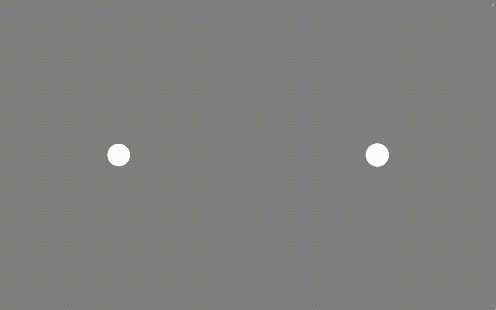

# Ebbinghaus and Müller-Lyer Illusions PsychoPy Experiment

This is a [Psychopy](https://psychopy.org) project consisting of an experiment where participants are shown stimuli related to the [Ebbinghaus](https://en.wikipedia.org/wiki/Ebbinghaus_illusion) and [Müller-Lyer](https://en.wikipedia.org/wiki/M%C3%BCller-Lyer_illusion) optical illusions. In each trial, participants are shown two stimuli (2 lines or 2 circles), and asked to use the up/down arrow keys to tweak the size of one of them in order to make them both be equal in size.

## Running the experiment
1. Install [Standalone PsychoPy](https://www.psychopy.org/download.html).
2. Download this project, by either using the green 'code' button and selecting 'Download ZIP', or by using `git clone` if you know Git.
3. Open up 'ebbinghaus_mullerlyer.psyexp' with PsychoPy.
4. Click the cogwheel ('Edit experiment settings') icon, go to the 'Screen' tab, and insert specifications appropriate for your monitor(s) (if you haven't already, you also need to do setup in Monitor Center - please see the [PsychoPy documentation](https://www.psychopy.org/)).
5. Click the Play ('Run experiment') icon.

## Output data
The most relevant output data files are the 'CSV'/'.csv' files, saved to the 'data' directory. The most important columns in these files are as follows:

* trial.adjustable_side: Specifies on which side the stimulus whose size the participant could manipulate was presented on. 'r' for right side, 'l' for left side.
* trial.duration: Trial duration in seconds.
* trial.adjustments_counts: Number of times that the participant adjusted stimulus size (i.e. pressed up/down key).
* trial.illusion_type: Type of illusion/stimulus that was used in trial: 'star' for practice/star stimuli trial, 'ebbing' for circles (Ebbinghaus illusion), 'muller' for lines/arrows (Müller-Lyer illusion).
* trial.context_used: Whether stimuli were presented with 'context' (i.e. surrounding circles for Ebbinghaus illusion, arrowheads for Müller-Lyer illusion) or without ('no_context': i.e. circles/lines are presented by themselves, meaning no illusion occurs).
* trial.small_circle_inward_arrow_side: For trials with context, describes on which side the context was present. 'r' for right side, 'l' for left side ('no_context' for trials without context).
* reference_minus_adjustable_size: The size difference between adjustable stimulus and target stimulus at end of trial, in [degrees of visual angle](https://www.psychopy.org/general/units.html#unitsdeg). This is the primary measure of participant task performance.

## Experiment flow / trials
The experiment consists of 84 trials, split into 4 blocks:
* 2 'Ebbinghaus'(E) blocks: All trials present an adjustable and a target circle.
* 2 'Müller-Lyer'(ML) blocks: All trials present an adjustable and a target horizontal line.

Each block includes 10 trials where 'context' (illusion) is present, and 10 where it is not (e.g. adjustable and target circle are displayed on their own). It is randomly decided for each block whether the 'context' or 'no-context' trials should come first.

Each block starts with a single 'practice' trial, where stars, without any surrounding context, are presented.

The experiment randomly decides whether to use the block order E-ML-E-ML or ML-E-ML-E.

## Translating the experiment
The default language is English. In PsychoPy, click the Text Components (e.g. in the routine 'instructions' there is a component 'text_instructions'). In the window that pops up, edit the 'Text' field. Once you've finished translating the experiment, save it ('Save current experiment file' in main window toolbar) and try running it again.

You can find a Swedish translation in the 'translations' directory.

## Attribution
This experiment was developed at Karolinska Institutet by Lowe Wilsson, while working in Janina Neufeld's research group. Tessa M. van Leeuwen of Radboud University gave much input during the development. The experiment was mainly based a previous experiment, described in:
> Burghoorn, F., Dingemanse, M., van Lier, R., & van Leeuwen, T. M. (2020). The Relation Between Autistic Traits, the Degree of Synaesthesia, and Local/Global Visual Perception. Journal of Autism and Developmental Disorders, 50(1), 12–29. https://doi.org/10.1007/s10803-019-04222-7

You are free to use and modify this experiment for non-commercial purposes (e.g. research is OK) __with attribution__. If you publish articles or share other work based on this project (e.g. if you share a modified version of it), you are required to cite the Burghoorn article above and link to this project's [GitHub repository](https://github.com/AnonZebra/ebbinghaus-mullerlyer-psychopy).

There is currently no published article based on data collected with this particular PsychoPy experiment, which is why you are asked to cite the Burghoorn article - note though that there are some differences between this experiment and the one they used (see their article for details).